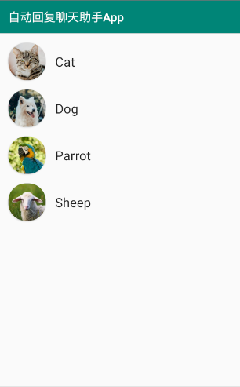
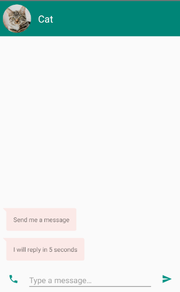
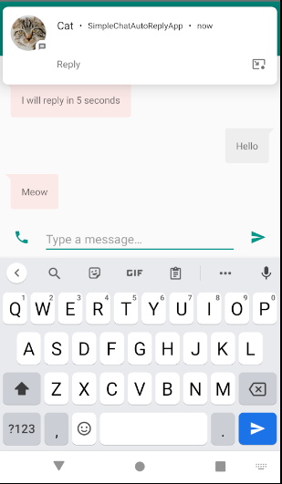
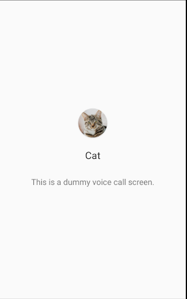

# Simple Chat Auto Reply App by Java

## 1. Introduction

This is a simple auto reply chat app implemented by java.

Origin app implemented by kotlin is [here](https://github.com/googlecodelabs/android-people.git)

## 2. 3rd framework

[1. Glide](https://github.com/bumptech/glide) for showing img

[2. BaseRecyclerViewAdapterHelper](https://github.com/CymChad/BaseRecyclerViewAdapterHelper) for showing data in RecyclerView

[3. CardView](https://github.com/chiemy/CardView) for showing rounded corner images

## 3. Tips:

1. Glide 's version <= 4.0.0

2. change gradle source -> In ${project}/gradle/wrapper/gradle-wrapper.properties

       distributionUrl=https\://mirrors.cloud.tencent.com/gradle/gradle-5.4.1-all.zip

## 4. Preview

<div>




</div>

## 5. Acknowledgements

```
https://github.com/android/
```

## 6. Contact

```
ligaoqi02@gmail.com
```

